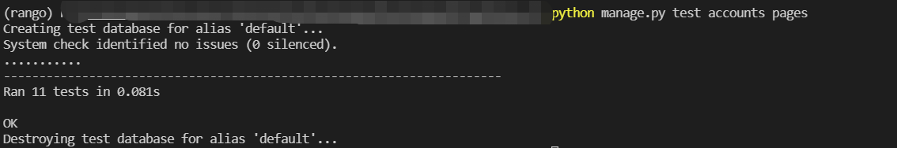

# Install database

step1. Enter the project directory '*WHISKY_V2/*', open the terminal , enter the command as follows:
```
python manage.py makemigrations pages accounts
```

step2 migrate the database again
```
python manage.py migrate
```

step3. create your own superuser
```
python manage.py createsuperuser
```

the database will generate automatically

step4. run *populate_whisky.py* will insert some testing data into the database

```
python populate_whisky.py   
```

# Automatically test
There are 2 Apps in this project, automatically tests contains database tests and view pages valid tests. In that way

1. you can run the test for both Apps:
```
python manage.py test accounts pages
```
2. or youcan run the test for these Apps separately:
```
python manage.py test accounts
python manage.py test pages
```
all tests has already passed 


